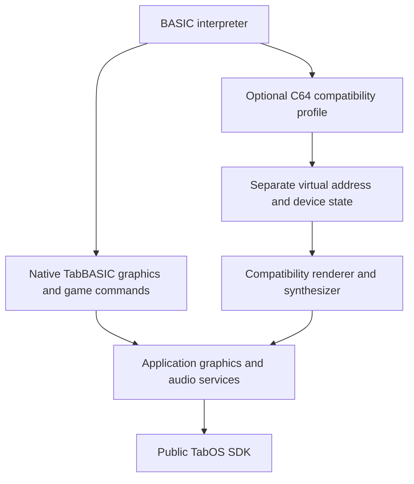

# TabBASIC C64-specific command policy

This policy defines the safety boundary for C64-oriented BASIC compatibility.
The implemented Model C graphics subset uses isolated application state; its exact
address map and limitations are in [safe C64 graphics](basic-c64-graphics.md).
Model B remains prohibited. Native TabBASIC graphics commands remain independent
of C64 addresses. Neither path exposes native addresses or arbitrary execution.

Current behavior is backed by the [compatibility matrix](basic-compatibility.md)
and checked-in policy tests. TI$ assignment and logical cursor tracking have been
repaired within this boundary.

## Decisions and safety matrix

“Future” below is a recommendation, not implemented behavior or authorization.
All currently disabled operations retain their safety gates. A bounded address
alone does not prove safety if it can corrupt interpreter control state.

| Feature | Current behavior | Future policy | Native-memory/execution risk | Stage |
| --- | --- | --- | --- | --- |
| PEEK | PARTIAL | Model C graphical subset implemented | No native dereference; separate virtual state only | Stage I |
| POKE | PARTIAL | Model C graphical subset; no interpreter-RAM alias | Virtual writes cannot corrupt live core RAM | Stage I |
| SYS | UNSUPPORTED | Keep disabled; exceptional named whitelist only after specific need | Arbitrary native, translated or language-RAM execution forbidden | No planned enablement |
| USR | UNSUPPORTED | Indefinitely disabled absent compelling new requirement | No indirect vector/function-pointer calls | No planned enablement |
| WAIT | UNSUPPORTED | Only documented virtual predicates with cooperative waits | No native polling or spin loops | Future compatibility stage |
| OPEN/CLOSE/CMD | UNSUPPORTED | Retain; bounded native-file profile may be designed later | Filesystem/resource scope only; no IEC/raw devices | Separate future channel stage |
| VERIFY | UNSUPPORTED | Later staged validation and byte comparison, without LOAD commit | Bounded filesystem read, no program mutation | Small separate enhancement |
| GET | PARTIAL | Preserve normalized nonblocking ASCII-oriented input | No C64 keyboard matrix/private hardware access | Accepted current adaptation |
| TI | PARTIAL | Preserve session-local monotonic 60 Hz read clock | No system-clock setter | Current |
| TI$ | PARTIAL; reads and validated six-character assignment work | Preserve session-local behavior | Only updates the session offset | Current |
| POS / PRINT comma / TAB | PARTIAL | Preserve logical-column tracking using TabOS terminal width | No private console/physical framebuffer access | Current |
| ST / READST | PARTIAL; zero with no channels | Explicit native status contract if channels are introduced | Never expose native descriptors/errno pointers | Current/future channels |
| PRINT#/INPUT#/GET# | UNSUPPORTED channels | Same future profile as OPEN, not implicitly enabled by LOAD/SAVE | Bounded logical handles only | Future channel stage |
| RND(0) | PARTIAL; pseudo-timer bytes | Preserve documented session-local behavior | No CIA access/entropy guarantee | Current |
| LOAD/SAVE | PARTIAL; bounded tokenized program files; personal-first packaged-example fallback | Preserve staged validation and personal-only SAVE | Public filesystem APIs, validated program writes | Current |

## PEEK/POKE: three models

**Model A — unsupported.** This is the current default and remains the recommendation
for the shipped baseline. Rejection happens before any address access. It is simple,
unambiguous and compatible with adding native graphics commands later.

**Model B — expose the interpreter's private 64 KiB RAM.** Reject as a general
compatibility interface. Reading bounded bytes cannot access native RAM directly,
but a write can corrupt program links, string/array descriptors, zero-page pointers,
return stacks or dispatch vectors. The generated C implementation assumes valid
internal state; bounds on the initial POKE do not prove bounds on later operations.
Its private array also contains synthesized KERNAL state and sparse ROM-derived
constants, not a coherent C64 bus. This model is both misleading and unsafe without
substantial hardening. Do not “solve” PEEK/POKE simply by deleting existing gates.

**Model C — separate virtual C64 address/device model.** Recommend as an optional
future direction, while retaining A until implemented and validated. The virtual
state must be a separate owned object, never an alias of `RAM` in cbmbasic. Pure
virtual data regions may be writable; language workspace, ROM/zero-page assumptions,
unimplemented devices and unknown regions must be denied unless individually
specified. Supporting a read-only synthetic value later is a profile decision, not
permission to expose the real core's bytes. Unsupported addresses return a clear
compatibility error, not arbitrary zeros that appear to emulate a device.

A documentation-only interface sketch (no header/API is added in Stage G):

```c
bool c64_virtual_read(c64_virtual_t *state, uint16_t address, uint8_t *value);
bool c64_virtual_write(c64_virtual_t *state, uint16_t address, uint8_t value);
```

`state` and the output pointer are trusted implementation objects, never values
supplied by BASIC. Validate BASIC numeric addresses/values before narrowing: no
negative wrapping or silently truncated native-sized input. Address arithmetic,
region ends and sprite spans need checked bounds before indexing. On false, the
caller reports an interpreter-native error; writes have no partial side effect.
Read masks, write masks, read-only fields, latches and reset values must be explicit
per region. Unimplemented behavior stays deterministic rejection. No native pointer
cast, native bus access, C64 IRQ execution or jump through RAM is allowed.

The generated core would eventually receive only narrow PEEK/POKE hooks, with
reproducible upstream patches. Device maps and render/audio implementations remain
outside generated code. Tests must cover every accepted region edge, invalid
numeric input, mirrored/unsupported ranges, corrupted virtual data, break/exit and
resource cleanup before gates are changed. The compatibility profile must be
explicitly selected and reset per application session. It must not change the
meaning of native graphics commands.



This boundary is feasible without rewriting BASIC's language engine. It is not an
implementation plan for a CPU emulator. The interpreter's current generic handling
of some internal JMP vectors is not a user-facing execution facility and must never
be reachable through newly enabled SYS/USR/POKE semantics.

## SYS, USR and WAIT

Keep arbitrary SYS disabled permanently within this native port architecture.
A future whitelist could recognize a small explicitly documented compatibility
entry point and execute a named safe operation, without dispatching its numeric
argument as any kind of address. Such a whitelist needs a real listing/use case,
argument/side-effect specification and regression tests. It must not include ranges
or fallback execution. A reserved SYS extension gateway is rejected as the primary
TabBASIC interface: it is opaque and conflicts with historical listings. Native
commands are clearer. Arbitrary translated labels, native function pointers, TabOS
addresses and arbitrary language RAM remain forbidden.

USR's numeric calling convention and indirect vector provide little benefit here.
Keep it indefinitely unsupported unless a strong compatibility requirement earns a
new review; never enable indirect function-pointer behavior.

Future WAIT could evaluate only supported virtual registers using the defined
`(read(address) XOR xor_mask) AND and_mask` condition. Its implementation would
recheck a virtual predicate after bounded public waits/yields, service Ctrl+C/Q,
and let TabOS schedule. No invented raster state that never changes, no tight
native polling and no promise of VIC/CIA cycle accuracy. Unsupported predicates
fail immediately; supported waits may remain pending until change or break, with
bounded service latency and tested teardown. A virtual timer/event model must exist
before WAIT is enabled. Existing TI-based BASIC loops are not hardware WAIT.

## Files and KERNAL channels

LOAD/SAVE do not imply IEC/tape/printer emulation. OPEN/CLOSE/CMD remain disabled.
A later native TabOS file profile is more tractable than general Commodore devices,
but requires its own proposal. A concrete candidate contract for that review is:

| Aspect | Candidate native-only contract, not implemented |
| --- | --- |
| Logical numbers | 1..15; fixed table; 0 reserved for console; reject duplicate opens and exhaustion |
| Devices | Only device 8 as an explicit TabOS-file alias; no printer, tape, network or device-15 command channel |
| Secondary address | 2 read, 3 create/truncate write, 4 append; these are native profile meanings, not authentic IEC behavior |
| Mode | Raw byte files, no implicit PETSCII/Unicode or CRLF conversion; PRINT# writes BASIC's CR byte, INPUT# parses the documented BASIC text subset, GET# reads a byte |
| EOF/status | ST bit 64 for EOF; status reset on successful open/read as specified; I/O failures use explicit BASIC file errors, never guessed IEC messages; full transition tests required |
| Selection | CHKIN chooses an open readable logical file; CHKOUT an open writable one; CMD redirects output through CHKOUT |
| Reset/close | CLRCHN restores console input/output without closing files; CLOSE releases the named handle and restores console if selected; CLALL and process exit close all owned handles |
| Paths | Explicit validated TabOS drive paths, bounded copied names, normal public open/read/write/close and host root mapping; never native host paths |
| Resource lifetime | Bounded handles/buffers, deterministic cleanup on BASIC errors, Ctrl+C/Q and child teardown; partial I/O and close failures tested |

The deliberate raw-byte mode keeps string bytes separate from terminal conversion.
A future text-mode option would need an explicit encoding/newline contract, not a
silent change. Existing SETNAM's 63-byte limit should remain until separately
reviewed; a wider channel filename must not bypass that bound accidentally. The
candidate above is not an instruction to build channels in Stage H. An IEC-compatible
profile would additionally need device status channels, suffix parsing, file types,
sequential/relative behavior and error/status conventions: defer it.

VERIFY is a reasonable later small enhancement. Extract a shared staging helper
from `basic_storage_load()` that resolves the same path/device/secondary policy,
opens a bounded regular file, reads/closes fully and validates the tokenized $0801
program. Compare length and bytes with a validated snapshot of the live program;
never call LOAD and then undo it. The current LOAD routine commits with memcpy and
changes X/Y, so it cannot be reused wholesale. Separate staging from the LOAD
commit step, preserve all program bytes/pointers/variables on match and mismatch,
and free/close before interpreter error recovery. Specify match/mismatch/status
and continuation semantics before implementation; do not assume the generic BASIC
error path preserves all variables. Test no mutation, malformed/truncated files,
partial I/O, compare mismatch, allocation failure and cancellation cleanup. VERIFY
remains unsupported now.

## GET and related behavior

Keep normalized TabOS input, nonblocking polling, empty string/numeric zero for
no key, case-preserving ASCII-oriented text and ordered queue consumption. Ctrl+C
is BASIC break; Ctrl+Q exits the application. They are reserved, not characters
returned by GET. No private keyboard controller or C64 keyboard matrix is accessed.
Programmatic keyboard-buffer POKEs and matrix/CIA scanning are outside the profile.

PRINT#/INPUT# reach disabled KERNAL channel selection. Direct GET# first reports
ILLEGAL DIRECT; a stored GET# reaches the disabled channel and reports the existing
unsupported diagnostic. READST currently returns zero, so ST=0 does not imply
working disk status. CLRCHN/CLALL are harmless no-ops while no channels exist.
RND(0) uses generated pseudo-timer bytes in private RAM; these are not a CIA model
and must not silently become the future virtual machine's hardware state.

## TI and TI$: actual behavior

Classification: **TI PARTIAL; TI$ PARTIAL.**
Both read the same session clock:

```text
floor(elapsed_monotonic_ms * 60 / 1000) + session_offset
modulo 5,184,000 ticks (24 hours)
```

The origin and offset start at application initialization, not TabOS boot or local
midnight. The first human-issued read may already be nonzero. No calendar time,
timezone, RTC or system-clock setter is involved. NEW, CLR and RUN do not reset the
session clock. TI counts ticks; TI$ formats whole seconds as six HHMMSS digits.
TI numeric assignment gives `?SYNTAX  ERROR` and leaves the clock unchanged.

The deterministic test clock starts at a deliberately nonzero host timestamp, yet
BASIC reads `0 000000`. At elapsed 16 ms TI is 0; at 17 ms it is 1; at 1 second it
is 60 and TI$ is 000001; at 61 seconds they are 3660 and 000101. At one millisecond
before a day they are 5183999 and 235959; at exactly a day both wrap to zero. Another
day plus one second reads 60/000001. These are injected-clock host tests, not
physical timing accuracy measurements.

`TI$="123456"` sets the session clock to 12:34:56. Assignment requires exactly six
decimal digits with hours 00–23 and minutes/seconds 00–59. Invalid values report a
BASIC error and preserve the clock. This strict validation is an intentional TabOS
adaptation. Numeric TI assignment remains unsupported. C64 tape-I/O clock stopping,
CIA timing and wall-clock accuracy are not emulated.

## POS and PRINT behavior

POS, comma zones and TAB share the application logical-column tracker. Wrapping
uses the current TabOS terminal width rather than an emulated 40-column screen;
SPC remains literal spacing. The compatibility matrix therefore classifies this
behavior as partial.

The application-owned tracker covers interpreter output, editor echo/backspace,
prompts, line rejection and adapter diagnostics. CR/newline resets the column,
Backspace decrements it, printable characters and emitted spaces advance it, and
wrapping uses the terminal width reported by public `ioctl(TABOS_TTY_GET_SIZE)`.
POS returns the tracked byte-sized position, saturating above 255; PRINT comma
zones and TAB use the same current position. Native and RV32 tests cover current
columns, zone boundaries, trailing semicolons, wrapping, backspace, errors and POS
consistency.

The ordinary stdio ELF path already owns its console session, so BASIC does not
acquire a competing session or require private console APIs. The tracker does not
implement full PETSCII cursor/control semantics, reconstruct arbitrary external
terminal cursor movement or reflow, or simulate a 40-column VIC-II display. These
remain explicit compatibility limits rather than reasons to alter native terminal
geometry.

## PETSCII policy

String operations retain BASIC byte semantics; terminal encoding is separate.
The editor admits printable ASCII with the 80-byte logical line bound. Current
CHROUT emits ASCII bytes 32..126, maps CR (13) to newline and cursor-right (29) to a
space, and discards other controls/high bytes. Tests show CHR$(147) and CHR$(255)
produce no output between A and B. CP437 capability in TabOS does **not** mean
BASIC currently forwards all CP437 or implements PETSCII.

| Level | Policy |
| --- | --- |
| 0 | Current ASCII subset plus the two existing control mappings; preserve it |
| 1 | Possible printable PETSCII conversion, with explicit upper/lower character-set mode and replacement policy; map to CP437 or application glyphs because current terminal is single-byte, not a Unicode terminal |
| 2 | Selected documented controls (clear, home, color, reverse, cursor) through public services; define how they affect editor and column state |
| 3 | C64 screen cells, screen-code conversion, character graphics, scrolling and ROM/RAM glyph semantics; separate optional compatibility renderer, not Stage G |

Do not alter stored string bytes to implement terminal translation. Pixel drawing
commands and PETSCII character graphics are independent APIs; neither should borrow
the other's syntax implicitly. Any glyph assets need provenance/licensing review;
no C64 character ROM is added by this policy.

## Feasibility of virtual display and sprites

TabOS already offers public RGB565 primitives, bitmap blits, transparency options,
logical canvases, scaling and presentation. A compatibility renderer can own a
small logical canvas and render cells/sprites into it, then call the SDK. For example,
a 320x200 active area plus explicitly chosen borders could fit the existing scaled
canvas contract. Border size, PAL/NTSC geometry and aspect handling must be declared;
no existing C64 rendering or raster-fidelity claim follows from this feasibility.
Fullscreen suspends terminal presentation; on BASIC break/exit, close or switch
ownership through public APIs and restore the retained terminal. No framebuffer
addresses or private ESP-IDF operations belong in BASIC.

| Virtual address/state | Required future semantics |
| --- | --- |
| $0400–$07E7 | Default 40x25 screen cells, screen codes and dirty-cell tracking; not ASCII bytes |
| $D800–$DBE7 | Per-cell low-nibble color; explicit high-bit/read behavior |
| $D020 / $D021 | Border/background palette indices, rendering bounds and read masks |
| $D000–$D00F / $D010 | Eight sprite X/Y pairs and X high bits; conversion from VIC coordinates, clipping |
| $D015 | Eight enable bits, visibility and deterministic reset state |
| $D017 / $D01D | Vertical/horizontal expansion |
| $D01C | Multicolor interpretation; not ordinary RGB bitmaps |
| $D025 / $D026 | Shared multicolor palette entries |
| $D027–$D02E | Individual sprite colors |
| $07F8–$07FF at default screen base | Eight pointers into 64-byte slots; 63 bitmap bytes describe 24x21 pixels |
| Sprite data | Separate bounded virtual RAM; checked pointer arithmetic, snapshot reads and redraw on writes |

The initial profile should fix a declared VIC bank/screen/character layout and
reject unsupported bank changes. Later relocation requires $D018, CIA2 bank-select
semantics ($DD00 and relevant direction state), moved sprite pointers, glyph/data
address rules and ROM visibility. Sprites also require priority, collision latches,
multicolor widths and layering; recognizing coordinate registers is not sufficient.
Raster IRQs, bad lines, border tricks and cycle-timed sprite multiplexing are not
promised. Character ROM/RAM adds screen-code lookup, charset mode/banking and asset
provenance. Separate virtual sprite bytes at addresses such as $0340 must not
modify the actual interpreter's tape buffer or private workspace.

Resource feasibility still needs measurement: a full separate 64 KiB virtual space
plus a 320x200 RGB565 canvas (125 KiB) already requires 189 KiB before glyphs,
additional buffers and synthesis state. This is material against the current
256 KiB application heap request. Determine which allocations are SDK/application
owned, measure peaks and consider sparse regions or reused buffers before changing
resource requests. No fit, frame-rate or real-time audio guarantee is made here.

## Selected SID implementation, separate from graphics

An appropriate public audio transport **exists**: `<tabos/audio.h>` provides
process-owned mono/stereo signed 16-bit little-endian PCM streams, negotiated
supported rates, nonblocking writes, status, gain and close/flush. Public wait
sources handle EAGAIN/backpressure; all open streams share the physical rate.
See [Audio Service](audio.md). BASIC's native SOUND path uses this API.

Stage J implements an application-local synthesizer for selected virtual SID
frequency/pulse-width, waveform/gate, ADSR and master-volume state. It generates
bounded PCM chunks through that API with queue status, cooperative scheduling and
tested cleanup/break responsiveness.
The native SOUND interface must be independent of SID registers. SID frequency
conversion depends on a declared chip clock profile; basic audible similarity does
not imply filter, combined-waveform, noise, oscillator sync/ring modulation, analog
6581/8580 or cycle accuracy. Paddle/oscillator/envelope readbacks require separate
semantics. The implemented profile deliberately omits filters, combined-waveform
fidelity, sync/ring behavior and hardware readbacks. No private platform audio
access is used. See `basic-c64-sid.md` for the exact contract.

## Likely compatibility tiers and prevalence limits

There is no defined representative population of C64 BASIC games here, so this
review cannot defensibly estimate a percentage that would run. The following is a
qualitative dependency assessment, not measured success rates. Commodore's sprite
example requires pointer/data POKEs plus VIC position/enable/color and a screen
control; its sound tutorial explicitly programs SID through POKE. These examples
show why recognizing only screen RAM is insufficient, but are not a random sample
of games. No external game corpus was executed in Stage G.

| Tier / program style | Typical dependencies and prospect |
| --- | --- |
| 1: pure BASIC/text | Tested language subset is useful now; terminal/PETSCII and storage differences still matter |
| 2: simple screen/color/sprites in BASIC | Screen/color RAM, VIC state, sprite pointers/data; plausible with a tightly specified Model C profile |
| 3A: selected sound BASIC | Bounded SID register tones; partial Stage J support with documented synthesis adaptations |
| 3B: timing/device BASIC | Raster/collision state, CIA input/timers/banks, filters and custom character RAM/ROM; unsupported |
| 4: SYS/USR machine code | Native C64 code, loaders, ROM calls, IRQ routines; out of scope without a separately approved CPU/C64 emulation architecture |

Screen/color memory is central to memory-written character games; VIC and sprite
data are central to sprite listings; SID is central to POKE-driven music; CIA enters
keyboard/joystick, bank and timer-dependent programs; charset dependencies arise in
custom character graphics; SYS/USR divides machine-code-assisted listings from
pure BASIC. These are conditional dependencies, not frequencies across all games.
Future compatibility claims need a named, licensed corpus with per-program required
features and executed outcomes, including frame/output/keyboard expectations.

## Evidence and remaining limits

The policy tests use the production core/adapter with an optional test-only injected
monotonic clock. Native Debug ASan/UBSan and optimized Release tests cover exact
boundaries and error paths. Actual RV32 runs retain the language corpus, safety
rejection and storage/interaction/lifecycle regressions, and add TI/TI$/POS checks.

The six accepted limitations stay open: unidentified installed Tab5 firmware/config,
unmeasured device stack/heap high-water, uncaptured serial watchdog logs, incomplete
physical 80/81-byte boundary, unverified post-copy executable hash, and untested
external Commodore file interoperability. No new hardware validation was performed.
The terminal-width POS/PRINT adaptation remains explicit.

Historical reference evidence comes from Commodore's *C64 Programmer's Reference
Guide*: [TI/TI$](https://www.devili.iki.fi/Computers/Commodore/C64/Programmers_Reference/Chapter_2/page_089.html),
[POS/PRINT](https://www.devili.iki.fi/Computers/Commodore/C64/Programmers_Reference/Chapter_2/page_070.html),
[memory map](https://www.devili.iki.fi/Computers/Commodore/C64/Programmers_Reference/Chapter_5/page_311.html),
[I/O register map](https://www.devili.iki.fi/Computers/Commodore/C64/Programmers_Reference/Chapter_5/page_320.html),
[sprite pointers](https://www.devili.iki.fi/Computers/Commodore/C64/Programmers_Reference/Chapter_3/page_133.html),
[short sprite example](https://www.devili.iki.fi/Computers/Commodore/C64/Programmers_Reference/Chapter_3/page_153.html),
[SID introduction](https://www.devili.iki.fi/Computers/Commodore/C64/Programmers_Reference/Chapter_4/page_184.html),
and [keyboard matrix/editor](https://www.devili.iki.fi/Computers/Commodore/C64/Programmers_Reference/Chapter_2/page_094.html).
These primary-document transcriptions inform the design; executed tests and local
SDK/source inspection establish current TabOS behavior. The proposed device model
is engineering judgment, not a compatibility guarantee.
