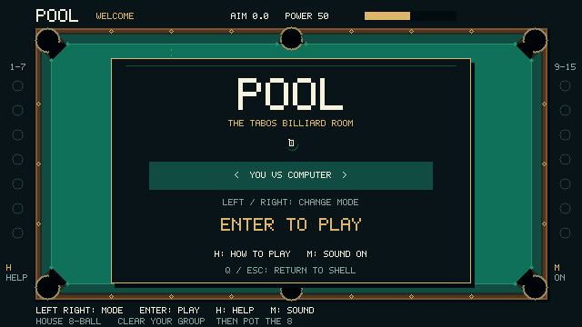
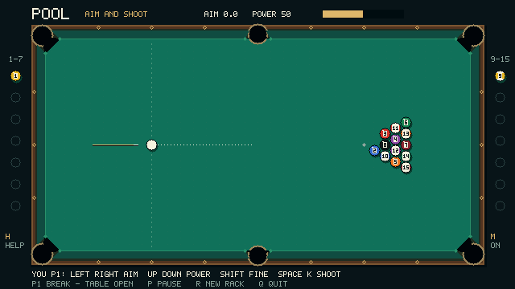

# Pool

Pool is a standalone **house 8-ball game** against the computer or another local
player, with title, help and result screens and optional speaker sound.
You are Player 1 and break first; the computer controls Player 2.
On the welcome screen, use **Left/Right** to choose the mode, then **Enter**
to play. `pool --two-player` preselects shared-keyboard play.
Aim, choose power and shoot with **Space or K**. The footer shows whose turn it
is, assigned solids/stripes, remaining balls, fouls and the winner.

Groups stay open after the break and are assigned on a later legal pot. Pot your
group to continue; clear it before shooting the 8. Fouls give the other player
ball in hand. An 8 on the break reracks with the same breaker. Read the
[house rules and outcome table](pool-rules.md) for the exact simplifications.

During ball in hand, move the cue preview with **arrows or WASD** and press
**Enter** on a gold valid position. Red is blocked. Enter confirms placement;
**Space/K shoots**. The computer chooses and takes its own shots and places
its own cue after a foul. P, R and Q remain available during its turn.



## Build and run

From the repository root:

```sh
./apps/build.sh
./tools/tabos macos debug run
```

Enter `pool` at the TabOS shell for a computer match, or `pool --two-player`
to preselect two people sharing the keyboard. Press Enter on the welcome screen
to start. On Linux use the corresponding
`./tools/tabos linux debug run` command on a Linux host.

With the RISC-V toolchain already active, `make -C apps/pool` builds and installs
the application individually. The extensionless executable is
`build/apps/pool/pool`, installed at `.local/rootfs/T/bin/pool`.
`./apps/build.sh` discovers it automatically; no script entry is necessary.
Normal installation also copies `apps/pool/LICENSE` to
`.local/rootfs/T/share/licenses/pool/LICENSE`. Preserve that notice when sharing
the executable. The existing MSC workflow copies it automatically.
For Tab5, copy it into the microSD `bin/` directory, or use the existing
`./apps/build.sh --msc` workflow while the device is in USB storage mode.

## Controls

| Key | Action |
| --- | --- |
| Left/Right or A/D | Choose mode on the welcome screen; rotate aim; move the cue preview horizontally during placement. |
| Up/Down or W/S | Increase/decrease power from 1 to 100; move up/down during placement. |
| Aa/Shift held | Fine aim or slow placement adjustment. |
| Space or K | Shoot at the selected aim and power. |
| Enter | Start from the welcome screen, confirm placement/new rack, dismiss help, or play again after a result. |
| P | Pause/resume, including placement. |
| H | Open/close help; freezes play and computer planning. Enter or Escape also closes help. |
| M | Mute/unmute optional effects; selection persists across new racks. |
| R | Ask for a new rack; Enter confirms, R or Escape cancels. |
| Q or Escape | Return to the shell; Escape closes help or cancels a pending new-rack request before it exits. |

A tap makes one small adjustment; holding a direction continues at 60 control
ticks per second. Normal aim moves about 58 degrees/second, fine aim about 5.3.
The angle wraps through 360 degrees. The power value is a percentage and the
bar shows the same setting. Opposing held directions cancel; releasing one of
an arrow/WASD pair does not release the other.

The cue pulls back with selected power. The short dashed line shows direction,
clipped conservatively to the rectangular table bounds. It does not predict object-ball
contacts, rebounds or pots. During motion the cue/guide disappears and the HUD
shows BALLS MOVING. It returns to AIM AND SHOOT when all balls stop completely.

Aim and shooting are allowed only when every ball has zero velocity, no shot
is in progress, and the game is unpaused. Shots pressed while unavailable are
ignored, never queued. Pausing, resetting or firing blocks already-held keys
until release. Space and K form one trigger: both must be released before a
fresh shot after a reset or after all balls stop. OS repeats never fire a shot or add extra control
steps. Quick down/up taps work even when delivered together.

New-rack confirmation freezes play and preserves the previous pause state if
cancelled. Confirmation starts a fresh Player 1 break and preserves the selected
computer/two-player mode and mute setting. Result states block shots. Help preserves
the previous pause state; closing help during pause leaves the game paused. Human aim, power, placement
and fire inputs are ignored during computer turns; held inputs cannot carry
over into an automatic shot or the next human turn.

The accepted Stage 1 inspection keys have been replaced by the planned aim/power
controls. Its table geometry, rack and numbered ball artwork remain unchanged.

## Geometry checkpoint

A 640×360 RGB565 canvas fills the Tab5 landscape display at 2×. Table-local
coordinates run from `(0,0)` to `(528,264)`, with positive Y down; rendering adds
`(56,48)`. The ball radius is 7 logical pixels. HUD/instructions fit outside
the rails and leave the upper-right region available for OS status overlays.

`apps/pool/src/table.c` is the single source for six finite cushion faces,
their tapered backs, endpoint jaw centers (radius 2), and six pocket centers,
capture-circle radii and mouth endpoints. Corner faces stop 18 pixels before
the corner. Side mouths have endpoints 16 pixels on either side of the center,
leaving 28 pixels between the two radius-2 jaws. Corner mouths are diagonal;
their approximately 25.5-pixel endpoint spacing leaves about 21.5 pixels between
jaws. Both provide clearance for a 14-pixel ball. Corner sinks are centered 4
pixels beyond both edges, radius 11; side sinks are 6 pixels behind the nose,
radius 10. Stage 5 uses the finite mouths for capture and the endpoint centers/radii for jaw contacts; the sink circles remain artwork.

The cue ball is at `(132,132)` and the rack apex at `(396,132)`. Integer rack
rows advance 13 pixels with a 7-pixel stagger; same-row centers are 14 pixels
apart. No ball circles overlap. The 8 sits in the middle of the third row,
with a solid and stripe at opposite rear corners. The small diagonal rack gaps
are intentional at this stage; a tighter fractional rack requires explicit review before any future change. Labels 1–15 use compact 3×5 digits on light patches, and stripes have
white caps and colored bands.

The game draws through public SDK primitives into one 450 KiB logical canvas.
Application metadata requests a 1 MiB heap and 16 KiB stack. It uses a fixed
60 Hz clock, bounds catch-up to 100 ms, and subtracts presentation time before
sleeping. Idle or pre-transition time never advances a newly pressed control or
resumed shot. It redraws on changes and requests an infinite keyboard wait when
neither movement nor continuous adjustment is active.
The host interpreter internally retries pending waits at up to 10 ms intervals;
this is runtime behavior, not an application polling or power measurement.

`game.c` owns shot state and the unchanged 4096-direction Q12 angle table.
Selected power maps monotonically from 30 to 600 logical pixels/second, stored
as Q12 pixels per 60 Hz tick (0.5 to 10). `physics.c` owns movement, friction and ball contacts;
`clock.c` converts elapsed milliseconds into bounded ticks; `rules.c` resolves
turns and outcomes once per settled shot. These modules have
no SDK dependencies. `ai.c` chooses shots and uses the same placement/shoot
commands, without changing object positions or potted state. `input.c` translates public key events into commands;
`main.c` owns SDK lifetime and scheduling; rendering only reads game state.
There is no runtime floating-point or trig library and no per-tick allocation.

## Accepted movement contract (Stage 3)

- Positions and velocities use signed 32-bit Q12 integers (`ONE = 4096`).
  Products and squared magnitudes use 64 bits; square root is an integer floor
  operation bounded to 32 iterations.
- Each 60 Hz tick integrates four substeps. Signed division remainders carry
  between substeps, so an unobstructed tick displaces each axis by its full
  velocity, including negative and subpixel motion.
- Centers stay inside `[7,521] × [7,257]`. These continuous rectangular practice
  boundaries close all six mouths. This closed-mouth configuration is retained only for accepted regression fixtures.
  Live play now uses the Stage 5 openings and jaws described below.
- An incoming cushion contact clamps the center to the boundary and reverses
  only the normal velocity with restitution 0.85. Tangential velocity is
  unaffected by the rebound. A departing ball is not reflected again. Corners
  handle both axes; contact clears the reflected axis's displacement remainder.
- After integration and cushion loss, rolling friction removes 114 Q12 speed
  units per tick (about 100.195 pixels/second²), scaling both components by the
  same ratio. Speed at or below 137 Q12 units (about 2.007 pixels/second) becomes
  exactly zero. No spin, axis-by-axis stopping or endless tiny drift.
- Nominal straight-shot stop times without cushions, measured by recentering
  between test ticks, are 17 / 186 / 359 ticks for powers 1 / 50 / 100:
  about 0.283 / 3.10 / 5.983 seconds. Cushion losses shorten travel. The 12,288
  tested trajectories from the initial cue position stop within 285 ticks
  (4.75 simulation seconds).
- Normal shot components never exceed 40,960 Q12 units (10 pixels/tick).
  Angle-table rounding bounds displacement magnitude below 2.501 pixels per
  substep. Legal X coordinates are at most 2,134,016 Q12 units; one pre-clamp
  integration adds at most 10,240. Even allowing both components at their maximum,
  squared speed is at most 3,355,443,200; intermediates explicitly use 64 bits.
  Integer rounding never increases speed. A cushion can discard up to one
  substep's overshoot; this is a bounded arcade rebound, not swept contact timing.
- A delayed frame contributes at most six ticks. Excess wall time is counted in
  the clock's saturating `discarded_ms` diagnostic field. Under overload the game
  slows relative to wall time; it never takes an oversized physics step. Pause,
  reset, firing and idle transitions clear the fractional tick accumulator.
  Equal tick/shot sequences are deterministic; overloaded wall time is not a
  promise of equal travel. These constants remain the Stage 3 regression baseline.

## Ball contacts (Stage 4 baseline)

All 16 balls now share the fixed-step simulation. Each substep advances their
centers, then resolves pairs in stable ball-ID order for at most four passes
(120 pairs per pass). Broad axis rejection avoids distant work. Overlapping
balls receive symmetric position correction with an 8-Q12-unit clearance target
(about 0.002 pixels), followed by cushion checks. A coincident pair gets a fixed
horizontal separation direction. Correction never generates velocity.

Approaching pairs exchange equal and opposite normal impulses with restitution
0.97, preserving total momentum and leaving tangential velocity unchanged before
rolling friction. Separating pairs receive no second impulse. Products use
64 bits and the unnormalized contact vector, avoiding normal-table error. An
impulse that would add energy through integer rounding is rejected. Friction and
cushion constants are unchanged; all balls must reach exact zero velocity before
aiming and shooting are enabled again.

The first contact pass also checks the relative swept segment against the
14-pixel collision diameter. A closest-point test rejects misses; at most 16
binary refinements locate entry in Q16 substep time. The pair receives its
impulse at that contact and advances through the remaining fraction with its new
velocities. This catches narrow grazing contacts between sampled endpoints.
Displacement remainders are cleared when impulses change velocity. Later passes
resolve overlaps and recheck cushions.

This is a bounded sequential arcade solver, not a global chronological collision
solver. Nearly simultaneous multi-ball contacts depend on stable pair order;
swept paths in a substep that also meets a cushion are approximations of that
substep's endpoints. Sweeps and separation are independently exercised by the
regressions, but arbitrary arrangements are not claimed mathematically exact.
The rack geometry and spacing remain unchanged from Stage 1.

A legal shot begins with all balls at rest, so no contact can raise the system's
initial kinetic energy. A ball may gain speed from another ball, but its speed
cannot exceed the original shot's total-energy bound (about 600 pixels/second,
including angle-table rounding). Free-flight displacement therefore stays below
2.501 pixels per substep. Position corrections are separate from that travel
bound. At most 1,920 pair visits and 480 swept candidates occur per tick; loops
allocate nothing. The two fixed 16-entry vector arrays occupy 256 bytes combined.
These counts are bounds, not measured Tab5 frame-rate or stack results.

The 64 accepted closed-mouth rack fixtures settle within 252 ticks (4.2 simulation seconds).
Their worst measured end-of-tick penetration is 34 Q12 units (0.0083 pixels),
and final separation error is at most 16 units (0.0039 pixels). All tested
full-power breaks move at least ten object balls. Lower-power or off-center
shots can move fewer balls. The pinned rack replay hash is
`12261552135598244603`; the Stage 3 one-ball hash remains
`10097316036875414284` unchanged.

## Pockets and scratches (Stage 5)

Live play uses the six finite cushion faces and twelve rounded jaw endpoints
from the original geometry. The collision radius at a jaw is ball radius plus
jaw radius: 9 logical pixels. Each substep checks straight faces, swept jaw
circles and finite mouth crossings; an earlier boundary contact wins, including
an exact tie with capture. Jaw reflections use the same 0.85 normal restitution
as cushions, preserve the tangent before rolling friction and reject energy gain
from integer rounding. At most four boundary events are resolved per substep;
if that bound is reached, the remaining displacement is discarded at the last
corrected contact point.

A ball is potted when its **center crosses the finite mouth line toward the
pocket center**, after earlier jaw/rail contacts. This uses the throat geometry,
not proximity to a screen edge or a large circular trigger on the cloth. Capture
happens at throat entry rather than waiting for the whole ball to reach the drawn
sink circle. This inexpensive arcade choice also avoids a stopped ball getting
stranded behind a mouth. A ball passing nearby on the cloth is not captured.
There is no sinking animation yet.

The persistent potted mask removes captured balls from rendering, integration
and subsequent ball contacts immediately. Velocity becomes exactly zero. Physics
emits each captured ID and pocket once; game state stores the pocket for each
potted ball plus the current shot's capture sequence (up to 16 entries). Ordering
is deterministic by substep and the existing ball traversal, not a claim of global
chronological ordering for simultaneous events. A cue-ball pot is a scratch.

A scratch blocks further shots. While other balls move, the HUD says SCRATCH -
WAIT. After they stop, PLACE CUE appears with a preview at the original cue spot.
Arrows/WASD move it at 120 pixels/second; Aa/Shift slows placement to 15. Preview
movement is bounded by the table's rectangular center limits. Confirmation also
checks every unpotted object ball, the jaw circles and pocket mouth half-planes.
Invalid Enter presses leave placement active. The original spot can be blocked,
so the player must move the preview to a valid location. Gold/red colors indicate
validity while unpaused.

Enter returns the cue with zero velocity and leaves all other balls and pots
unchanged. It requires a fresh press: a key held during motion cannot silently
confirm later. Confirmation blocks held controls until release and resets the
fractional clock, as pause/reset already do. Space/K never confirms or fires
while placing. Confirming a new rack clears all pot and match records. Stage 6
uses this same placement mechanism for every foul.

Straight-rail positions, tangential remainders, friction and ball impulses are
preserved. The closed-mouth Stage 3/4 replay fixtures remain available; their
old hashes are not expected for live trajectories that now enter pockets or hit
rounded jaws. Multi-ball contact ordering remains the bounded approximation
described above. Stage 6 adds rules through observational first-contact and
post-contact rail records, preserving the accepted physics.

## Computer opponent (Stage 7)

The computer checks 15 targets × 6 pockets, one candidate per 60 Hz tick.
It filters targets through the house rules, calculates the cue contact position
behind each target, and rejects blocked cue paths, blocked pot paths, cushion/jaw
intersections, invalid contact positions and cuts sharper than about 54 degrees.
Distance, cut difficulty and proximity of the contact point to pockets determine
ranking. Power estimates use travel distance, cut angle and the accepted friction.

Ball in hand tries a valid cue position 50 pixels behind each contact point.
If no direct pot is available, the computer prefers an unobstructed direct hit
on a legal ball. If every legal ball is blocked it makes a best-effort shot toward
one; it can foul. Fallback placement scans at most 162 grid positions using the
same validity check as human placement. Break fallback uses high power.

One fixed accuracy setting adds seeded aim error of ±3 angle units (about
±0.26 degrees) and power error of ±2 percentage points. The seed starts at
`0x504f4f4c` for each new rack; identical play is reproducible. Selection takes
90 ticks, then the chosen aim is displayed for 18 ticks before firing, about
1.8 seconds total at normal simulation speed. Pause and restart confirmation
freeze this process. Processing and rendering overload may lengthen wall time.

This is a direct-shot opponent with a basic contact fallback. It does not plan
banks, kicks, combinations or the next position, and its pocket-proximity penalty
is only a scratch-risk heuristic. It does not run speculative physics, move object
balls, alter pots, change rules or use different physics. Difficulty choices and
more presentation work remain outside this checkpoint. No per-tick allocation
or runtime floating-point/trigonometric functions are used.

## Presentation and sound (Stage 8)

The welcome screen selects computer or local play. Centered panels show help,
pause, new-rack confirmation and the winner with the rule outcome. The H and M
indicators sit beside the table, leaving the upper-right OS overlay area free.
Ball numbers, table coordinates, pockets, jaws and the direction guide retain
their accepted geometry. New punctuation completes the small original HUD font.

The left tray shows potted solids 1–7, and the right tray shows potted stripes
9–15. Empty rings are unpotted slots. These trays use the authoritative potted
mask, independent of which player owns each group; the footer still shows groups
and remaining counts. The 8 outcome is shown by the result panel.

A cue stroke remains visible for eight ticks after shooting, and a captured
ball's pocket gets an expanding ring for 18 ticks. These are visual feedback only:
velocity is still assigned immediately, and throat capture is unchanged. Help,
pause and restart confirmation freeze both physics and feedback. After effects
expire, still screens return to indefinite input waits.



See the [help panel](images/pool-stage8-help.png) and
[result panel](images/pool-stage8-result.png). These 640×360 captures use synthetic
presentation states through the real renderer; they are not hardware screenshots.

Optional 44.1 kHz mono PCM effects distinguish cue strike, first ball contact,
first post-contact rail/jaw contact, pot, foul and result. Contact sounds consume
the existing per-shot records; there is not a separate sound for every collision.
Only the highest-priority effect in a rendered update plays, so a busy break does
not queue a backlog. M toggles sound. Help, pause, restart, mute and exit stop it.

Effects use quiet triangle/noise PCM, last 25–160 ms and are generated offline
into read-only data. `python3 apps/pool/tools/generate_sound.py --check` verifies
that data; ordinary app builds do not require Python. Waveforms and volume are
unchanged from Stage 8.

Audio is prepared on entering/resuming unmuted play and reused throughout the
unpaused match, including a result screen. A shot never opens/closes the device
or synthesizes PCM. Pause, help, new-rack confirmation, mute and exit release it;
resume/start/unmute prepare it again. This intentionally keeps the audio backend
active between shots to avoid codec/SDL startup and shutdown stalls. Use P or M
when leaving the game idle and wanting audio hardware released.

At most eight nonblocking writes are attempted per effect. Errors disable further
effect IO until an explicit prepare transition; cleanup happens at a UI boundary,
not during moving-ball simulation. The app reports the last unresolved audio error
on returning to the shell. There is no effect-duration close deadline that can
expire while the device is still starting or the PCM is queued.

The Stage 9 bug-fix comparison used the actual RV32 app with a real macOS SDL
window and audio backend. In a sampled 1.2-second shot, the largest moving-frame
gap decreased from 135 ms to 44 ms; visible updates increased from 30 to 37.
The cue-origin pixel cleared after 96 ms before and 92 ms after. That proxy
includes the time for the ball to move off its original center, not just input
latency; it supports no claim of eliminated initial response delay.
These are one-session observations, not hardware guarantees or stable benchmarks.
Headless SDL skips real audio-device startup and cannot validate this cost.

The user confirms smoother gameplay and working Tab5 speaker playback after the
fix; instrumented hardware validation remains pending. If audio becomes silent,
check M is ON, run `audiotest tone speaker`, and record any error printed by Pool
when exiting. A tone failure points to device/firmware/routing outside this app
fix; a working tone with silent Pool needs a device-side playback trace.

## Validation

```sh
./tools/tabos macos debug build
ctest --test-dir build/macos-debug -R pool --output-on-failure
build/macos-debug/tests/tabos_pool_rv32 build/apps/shell/shell build/apps/pool/pool
```

The optional harness accepts a third argument for a PPM screenshot and uses a
temporary filesystem. Ordinary CTest does not require separately built app ELFs.
Use `macos-release` for Release checks and the matching `linux-*` paths on Linux.

`unit.pool_table` preserves the Stage 1 rack and pocket geometry checks.
`unit.pool_game` tests all 4096 directions, every power setting, cardinal and
opposite velocities, rest gates for all 16 balls, short-guide bounds, angle
wrap, fine aim, quick taps, aliases, repeats, power clamps and pause/reset/fire
release requirements.
`unit.pool_render` retains pocket and distinct-number checks across aim angles,
and checks cue/guide, power-bar and motion/pause feedback.

`unit.pool_physics` sweeps every aim angle at three powers, pins a replay hash,
checks monotonically decreasing speed, bounds and exact rest, and separately
covers signed substep remainders, all rails/corners, departing contacts, mirrored
mouth rebounds, diagonal friction, nominal stop times, pause and held-fire gates.
It verifies identical states for 1–100 ms frame cadences over equal elapsed time,
plus long-frame caps, discarded-time saturation and presentation-adjusted waits.

`unit.pool_contacts` retains closed-mouth coverage for head-on transfer, opposing moving balls, separating
and coincident pairs, 90,200 grazing/speed/phase cases, a 16-ball chain,
collision/cushion interactions at all corners, 64 rack shots and 128 consecutive
full-power shots. It checks energy, bounds, final separation and exact rest.
Swapping the IDs of an isolated pair preserves its result across 241 directions.
The all-ball rest gate remains closed when only an object ball is moving.

The real-RV32 harness checks aim/power, Shift, aliases, movement, paused-frame
stability, resumed travel, exact rest, another shot without reset, confirmed restart during
motion, cancellation, foul-driven turn handoffs, full-rack breaks and three zero-status exits with parent/terminal
restoration. It also aims a deliberate side-pocket scratch, verifies that held
Enter cannot auto-confirm, moves the preview and confirms without shooting.
Its optional screenshot captures cue placement after the scratch.

`unit.pool_pockets` checks 600 center-mouth pots (all six pockets at all 100
powers), 120 jaw approaches, nearby cloth passes, straight-rail equivalence,
2,214 oblique approaches, one-time capture records, inactive-ball exclusion,
scratch waiting, blocked/valid placement, input release and 128 open-table
full-power trajectories. The oblique sweep produces 770 pots and 1,444 returns
to cloth, including rebounds that can lead to another pocket. Render tests check
that potted objects disappear and placement uses the valid/invalid colors.

`unit.pool_rules` covers the documented outcome table for both players, complete
rule-driven racks, actual-physics 8-ball outcomes, no-contact ball in hand,
confirmation freezes/cancellation and held-key guards. It compares full ball
states and pot records with contact tracking enabled/disabled over 32 rack shots.

`unit.pool_ai` checks legal targets, a successful direct pot, blocked cue/object
corridors, shallow pocket approaches, ball-in-hand placement and dense-rack
fallback, bounded candidate progress, pause/confirmation/input guards and mode
preservation. Four seeded full-physics self-play racks end in legal wins after
52/38/53/37 shots. Each repeats identically, with pinned hashes shared by Debug
and Release. The RV32 harness additionally launches default computer mode,
forces ball in hand, pauses/cancels restart, observes an autonomous physical
shot, restarts and verifies exit to the shell.

Stage 8 adds input tests for mode selection, fresh Enter, help over title/motion/
pause, mute persistence, and purely visual timer expiry. Rendering checks cover
all panels, potted trays and the reserved OS region. `unit.pool_sound` checks
six distinct bounded waveforms, short writes, zero/EAGAIN/odd/oversized returns,
open/flush/close failures, explicit stream preparation/reuse, absence of device
startup/teardown during effects and event precedence.
The RV32 harness also opens help from title/play, switches mode and toggles mute.
Optional native panel captures use
`POOL_CAPTURE_PREFIX=/tmp/pool-stage8 build/macos-debug/tests/tabos_pool_render`.

Stage 8 passed macOS Debug/Release builds, all 82 CTests in each configuration,
both real-RV32 harnesses, strict RV32 source checks, an isolated clean app build,
and Tab5 Debug/Release firmware cross-builds. Linux execution and physical Tab5
frame rate, input latency, Aa combinations and display readability remain
unverified. Host execution and successful cross-compilation are separate from
physical device validation.

The user confirms smoother Tab5 play and working speaker audio after the final
correction, and MSC readback verified the installed app. Detailed hardware timing
and long-session checks remain unmeasured. See the
[final acceptance report](pool-acceptance.md).

The optional RV32 harness can exercise real host audio and video using
`POOL_TEST_WINDOW=1 build/macos-release/tests/tabos_pool_rv32 build/apps/shell/shell build/apps/pool/pool`.
It opens a window and drives its own temporary filesystem session. Its printed
latency and moving-frame samples are observational, not fixed timing assertions.
